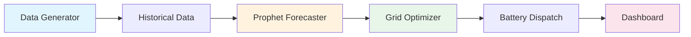

# ⚡ Smart Grid Demand-Response Simulator

[](https://www.python.org/downloads/)
[](LICENSE)
[]()
[]()
[]()

A **Digital Twin** simulation for modeling electricity demand patterns, renewable energy integration, and battery storage optimization. Built with Python, Prophet for forecasting, and Streamlit for visualization.

---

## 🎯 Features

- **📈 Load Forecasting**: Uses Facebook Prophet to predict future electricity demand with high accuracy
- **☀️ Renewable Integration**: Simulates solar and wind energy generation with realistic patterns
- **🔋 Battery Optimization**: Implements peak shaving, price arbitrage, and self-consumption strategies
- **💰 Cost-Benefit Analysis**: Evaluates the economic impact of different grid management strategies
- **📊 Interactive Dashboard**: Real-time visualization with Streamlit

---

## 🏗️ Architecture



---

## 🚀 Quick Start

### Prerequisites
- Python 3.10 or higher
- pip package manager

### Installation

```bash
# Clone the repository
git clone https://github.com/YOUR_USERNAME/smart-grid-simulator.git
cd smart-grid-simulator

# Create virtual environment (recommended)
python -m venv venv
venv\Scripts\activate  # Windows
# source venv/bin/activate  # Linux/Mac

# Install dependencies
pip install -r requirements.txt
```

### Usage

**1. Run the simulation:**
```bash
python main.py
```

**2. Launch the interactive dashboard:**
```bash
streamlit run dashboard.py
```

**3. Explore the analysis notebook:**
```bash
jupyter lab notebooks/analysis.ipynb
```

---

## 📁 Project Structure

```
smart-grid-simulator/
├── main.py              # Entry point - runs the simulation
├── dashboard.py         # Streamlit interactive dashboard
├── requirements.txt     # Python dependencies
│
├── src/                 # Core source code
│   ├── __init__.py      # Package initialization
│   ├── data_generator.py # Synthetic data generation
│   ├── forecaster.py    # Prophet demand forecasting
│   ├── optimizer.py     # Battery dispatch optimization
│   └── simulation.py    # Simulation orchestrator
│
├── data/                # Generated simulation data
│   └── simulation_results.csv
│
├── docs/                # Documentation
│   ├── PROJECT_EXPLANATION.md   # Beginner-friendly guide
│   ├── TECHNICAL_EXPLANATION.md # Technical deep-dive
│   ├── project_proposal.md      # Initial project proposal
│   ├── implementation_doc.md    # Implementation details
│   └── final_report.md          # Final project report
│
├── notebooks/           # Jupyter notebooks
│   └── analysis.ipynb   # Data analysis and visualization
│
└── tests/               # Unit tests (99% coverage)
    ├── test_data_generator.py
    ├── test_forecaster.py
    ├── test_optimizer.py
    └── test_simulation.py
```

---

## 📊 Dashboard Preview

The Streamlit dashboard provides three main views:

| Tab | Description |
|-----|-------------|
| **Demand & Forecast** | Compare actual vs predicted demand, view renewable generation |
| **Grid & Battery** | Monitor battery state of charge and grid import/export |
| **Financials** | Track cumulative costs and electricity price signals |

---

## 🧪 Testing

```bash
# Run all tests
python -m pytest tests/ -v

# Run with coverage report
python -m pytest tests/ --cov=src --cov-report=term-missing

# Lint check
python -m flake8 src/ main.py dashboard.py
```

**Current Status:** ✅ 8 tests passing | 99% coverage | 0 linting errors

---

## 📚 Documentation

- [📖 Project Explanation (Beginner)](docs/PROJECT_EXPLANATION.md) - Start here if you're new
- [🛠️ Technical Explanation (Advanced)](docs/TECHNICAL_EXPLANATION.md) - Deep dive into the algorithms
- [📄 Final Report](docs/final_report.md) - Complete project summary

---

## 🛠️ Technologies

| Category | Technology |
|----------|------------|
| Language | Python 3.12+ |
| Forecasting | Facebook Prophet |
| Data Processing | Pandas, NumPy |
| Visualization | Plotly, Streamlit |
| Testing | Pytest, Coverage |
| Code Quality | Flake8 (PEP 8) |

---

## 🤝 Contributing

Contributions are welcome! Please read [CONTRIBUTING.md](CONTRIBUTING.md) for guidelines.

---

## 📄 License

This project is licensed under the MIT License - see the [LICENSE](LICENSE) file for details.

---

## 🔮 Future Improvements

- [ ] MILP optimization using PuLP for globally optimal dispatch
- [ ] Real-world API integration (weather, electricity prices)
- [ ] Electric Vehicle (EV) charging simulation
- [ ] Docker containerization for deployment
