# ⚡ Smart Grid Simulator: Project Explained

Welcome! This document is designed to explain the **Smart Grid Demand-Response Simulator** project in simple terms. Whether you're a developer, a student, or just curious, this guide will help you understand what this project does, how it works, and why it matters.

---

## 📖 What is this Project?

Imagine you are running a small city's electricity grid. You have:
1.  **Homes and Businesses** that use electricity (Demand).
2.  **Solar Panels and Wind Turbines** that generate clean energy (Renewables).
3.  **A Big Battery** to store energy for later.
4.  **The Main Grid** (the power company) that you can buy from or sell to.

This project is a **Digital Twin** (a computer simulation) of that scenario.

### How Energy Flows

```mermaid
graph LR
    Sun[☀️ Solar / 💨 Wind] -->|Generates Power| Inverter(Inverter)
    Grid[🏭 Main Grid] <-->|Buy / Sell| Inverter
    Inverter <-->|Charge / Discharge| Battery[🔋 Battery Storage]
    Inverter -->|Powers| Home[🏠 Homes & Buildings]
```


It helps us answer questions like:
*   *"What happens if the wind stops blowing?"*
*   *"How much money can we save if we use the battery during expensive hours?"*
*   *"Can we predict how much power people will use tomorrow?"*

It uses **Artificial Intelligence (AI)** to predict the future (demand forecasting) and **Optimization Algorithms** to make smart decisions about when to charge or discharge the battery.

---

## 🌍 Real World Impact

Why does this matter?
*   **Sustainability**: By using batteries efficiently, we can use more solar/wind energy even when the sun isn't shining or the wind isn't blowing.
*   **Cost Savings**: Electricity is expensive during "Peak Hours" (like 6 PM). This system saves money by using stored cheap energy during those times.
*   **Grid Stability**: Preventing blackouts by reducing the strain on the main grid during heatwaves or storms.

---

## 🏗️ Project Structure: A File-by-File Walkthrough

Here is a detailed explanation of every single file in the project, so you know exactly what goes where.

### Root Directory
*   **`main.py`**: The entry point of the application. Run this file to start the simulation. It coordinates the entire process from data generation to saving results.
*   **`dashboard.py`**: The code for the interactive website. It reads the results generated by `main.py` and displays them in charts and tables using the Streamlit library.
*   **`requirements.txt`**: A list of all the external Python libraries (like `pandas`, `prophet`, `streamlit`) that this project needs to run. Installing this file ensures you have all the necessary tools.
*   **`README.md`**: The "front page" of the project. It contains quick instructions on how to install and run the project.

### `src/` (Source Code)
This folder contains the "brain" of the project.
*   **`src/data_generator.py`**:
    *   **Purpose**: Creates the fake world.
    *   **What it does**: Uses math to generate hourly data for electricity demand (people using power), solar generation (sun shining), wind generation (wind blowing), and electricity prices.
*   **`src/forecaster.py`**:
    *   **Purpose**: Predicts the future.
    *   **What it does**: Uses an AI model (Prophet) to look at past demand data and guess what the demand will be for the next day.
*   **`src/optimizer.py`**:
    *   **Purpose**: Makes smart decisions.
    *   **What it does**: Decides whether to charge or discharge the battery based on the current demand, available renewable energy, and electricity price.
*   **`src/simulation.py`**:
    *   **Purpose**: The conductor.
    *   **What it does**: Connects all the other files. It asks the generator for data, gives it to the forecaster, passes the forecast to the optimizer, and saves the final results.

### `data/`
*   **`simulation_results.csv`**: The output file. After running `main.py`, this file is created. It contains a big table with all the hourly data (Demand, Solar, Wind, Battery Status, Cost, etc.).

### `docs/`
*   **`PROJECT_EXPLANATION.md`**: (This file) A beginner-friendly guide to the project.
*   **`TECHNICAL_EXPLANATION.md`**: A deep dive for developers explaining the code logic and algorithms.
*   **`project_proposal.md`**: The initial plan describing why we built this project.
*   **`implementation_doc.md`**: Details on how the math and algorithms were implemented.
*   **`final_report.md`**: The final summary of the project's achievements and results.

### `notebooks/`
*   **`analysis.ipynb`**: A Jupyter Notebook. Think of it as a scratchpad for data scientists. It allows us to load the results, draw custom charts, and calculate statistics step-by-step to verify that everything is working correctly.

### `tests/`
*   **`test_*.py`**: These are automated tests. They check if the code is broken. For example, `test_battery.py` checks if the battery logic makes sense (e.g., it shouldn't be able to discharge if it's empty).

---

## ⚙️ How It Works: The Core Components

The project is built like a pipeline. Data flows from one step to the next.

### 1. The Data Generator (`src/data_generator.py`)
Since we don't have a real city to test on, we create one! This file generates realistic-looking data:
*   **Demand**: People use more power in the evening and less at night. It also changes on weekends.
*   **Solar**: Peaks at noon, zero at night. Clouds are simulated randomly.
*   **Wind**: Random wind speeds based on realistic weather patterns.
*   **Prices**: Electricity is more expensive in the evening ("On-Peak") and cheaper at night ("Off-Peak").

### 2. The Forecaster (`src/forecaster.py`)
This is the AI part. We use a tool called **Prophet** (developed by Facebook/Meta).
*   **Input**: It looks at the past 30 days of electricity usage.
*   **Learning**: It learns patterns (e.g., "Usage always goes up at 6 PM").
*   **Output**: It predicts what the demand will be for the *next* 30 days.
*   **Why?**: If we know high demand is coming, we can charge the battery beforehand!

### 3. The Optimizer (`src/optimizer.py`)
This is the "Smart" in Smart Grid. It decides what to do with the battery every hour.
*   **Goal**: Save money and prevent the grid from overloading.
*   **Strategy**:
    1.  **Store Excess**: If solar/wind produces more than we need, charge the battery.
    2.  **Peak Shaving**: If demand gets too high, discharge the battery to help out.
    3.  **Arbitrage**: Buy low (charge at night), sell high (discharge in the evening).

### 4. The Simulation (`src/simulation.py`)
This file ties everything together. It runs the generator, trains the forecaster, runs the optimizer, and saves the results to a file (`data/simulation_results.csv`).

---

## 📊 The Dashboard (`dashboard.py`)

We use a tool called **Streamlit** to create a beautiful, interactive website to view the results.

*   **Tab 1: Demand & Forecast**: Compare what the AI predicted vs. what actually happened.
*   **Tab 2: Grid & Battery**: See the battery charging (green) and discharging. Watch the "State of Charge" (purple line) go up and down.
*   **Tab 3: Financials**: Track how much money the system is costing or saving over time.

---

## 🚀 How to Run It

If you want to see it in action, follow these steps:

### Step 1: Install Requirements
Open your terminal (command prompt) and run:
```bash
pip install -r requirements.txt
```

### Step 2: Run the Simulation
This generates the data and runs the AI logic.
```bash
python main.py
```
*You will see text output telling you the simulation is running...*

### Step 3: Launch the Dashboard
This opens the interactive website.
```bash
streamlit run dashboard.py
```
*A browser window will open automatically showing the charts!*

---

## 🔮 What's Next?

Future improvements could include:
*   **Electric Vehicles (EVs)**: Simulating thousands of cars plugging in at once.
*   **Smart Appliances**: Turning off ACs automatically when prices are high.
*   **Real Weather Data**: Connecting to a live weather API instead of generating fake weather.

---

## 📝 Conclusion

This project demonstrates how **Data Science** and **Software Engineering** come together to solve real-world energy problems. By simulating these systems, engineers can design better, greener, and cheaper power grids for the future.
