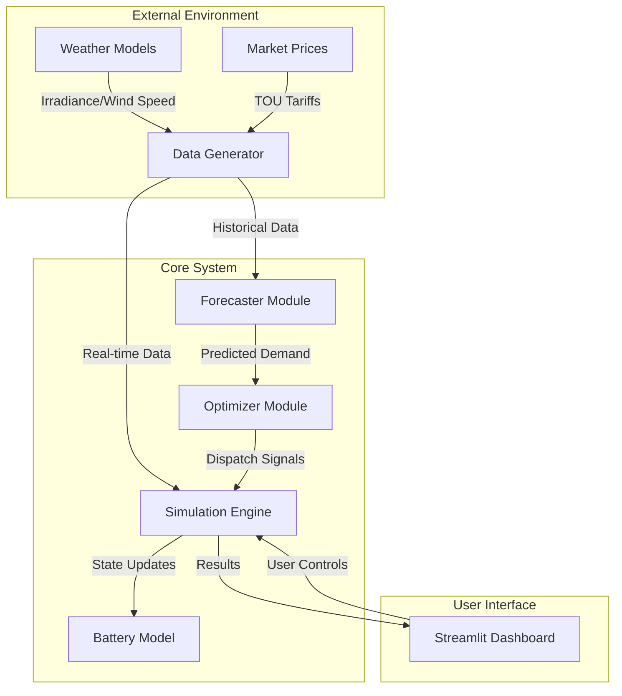

# Project Proposal: Smart Grid Demand-Response Simulator

## 1. Problem Statement and Motivation

### 1.1 The Challenge of Renewable Integration
The global shift towards sustainable energy has led to a rapid increase in the penetration of renewable energy sources (RES) such as solar and wind. While crucial for reducing carbon emissions, these sources are inherently intermittent and variable. Solar generation peaks during the day and vanishes at night, while wind generation fluctuates unpredictably. This variability poses significant challenges to traditional power grids, which were designed for dispatchable fossil-fuel generation that follows demand.

### 1.2 The Need for Demand Response
In a traditional grid, supply must always match demand. When renewable generation drops or demand spikes (e.g., during heatwaves), grid operators must bring expensive and polluting "peaker plants" online. Conversely, when renewable generation exceeds demand, clean energy is often curtailed (wasted) to prevent grid instability.

**Demand Response (DR)** offers a transformative solution. Instead of adjusting supply to match demand, DR adjusts demand to match available supply. By incentivizing consumers to shift usage to times of high renewable availability or low grid stress, we can:
-   **Reduce reliance on fossil fuels.**
-   **Lower electricity costs** for consumers and operators.
-   **Enhance grid stability** and resilience.

### 1.3 Project Motivation
The motivation for this project is to develop a **Digital Twin** of a smart grid environment to simulate and evaluate the effectiveness of these strategies. By modeling the complex interactions between variable generation, dynamic pricing, and battery storage, we can quantify the benefits of intelligent energy management systems (EMS). This simulator serves as a testbed for algorithms that will power the grids of the future.

## 2. System Architecture and Design

The system is designed as a modular Python application, following a clean architecture pattern to ensure scalability and maintainability.

### 2.1 High-Level Architecture

### 2.2 Component Descriptions

#### 1. Data Generator (`src/data_generator.py`)
This module is responsible for creating realistic synthetic data. It uses stochastic processes to model:
-   **Electricity Demand**: Base load + daily/weekly seasonality + Gaussian noise.
-   **Solar Generation**: Based on geographical latitude and time of year, with cloud cover noise.
-   **Wind Generation**: Weibull distribution for wind speeds converted to power via a turbine power curve.
-   **Dynamic Pricing**: Time-of-Use (TOU) tariffs with peak and off-peak rates.

#### 2. Forecaster (`src/forecaster.py`)
Accurate prediction is the backbone of effective control. This module utilizes **Facebook Prophet**, a robust additive regression model, to forecast future demand.
-   **Inputs**: Historical demand data (timestamps and values).
-   **Outputs**: 24-hour ahead demand forecast with confidence intervals.
-   **Key Features**: Handles missing data, outliers, and strong seasonal effects.

#### 3. Optimizer (`src/optimizer.py`)
The "brain" of the system. It determines the optimal operation of the Battery Energy Storage System (BESS).
-   **Objective**: Minimize total operational cost over a 24-hour horizon.
-   **Algorithm**: A heuristic greedy algorithm (for this phase) that prioritizes:
    1.  **Peak Shaving**: Discharging when demand > threshold.
    2.  **Arbitrage**: Charging when price is low, discharging when high.
    3.  **Self-Consumption**: Storing excess solar/wind instead of exporting.

#### 4. Simulation Engine (`src/simulation.py`)
The central coordinator that runs the time-step simulation. It:
-   Advances time (e.g., in 1-hour steps).
-   Calls the forecaster and optimizer.
-   Updates the state of the battery (State of Charge - SoC).
-   Calculates financial and energy metrics.

## 3. Hardware/Software Requirements

### 3.1 Software Requirements
-   **Operating System**: Windows, Linux, or macOS.
-   **Language**: Python 3.10 or higher.
-   **Core Libraries**:
    -   `pandas`, `numpy`: For high-performance data manipulation.
    -   `prophet`: For time-series forecasting.
    -   `plotly`: For interactive data visualization.
    -   `streamlit`: For the web-based dashboard.
    -   `pytest`: For automated testing.

### 3.2 Hardware Requirements
-   **Processor**: Modern multi-core CPU (Intel i5/Ryzen 5 or better) recommended for faster model training.
-   **RAM**: 8GB minimum (16GB recommended) to handle in-memory datasets.
-   **Storage**: 500MB free space for code, libraries, and generated data.

## 4. Expected Outcomes

By the completion of this project, we expect to deliver:

1.  **A Fully Functional Simulator**: A robust Python application capable of simulating grid operations over extended periods (days/months).
2.  **Validated Forecasting Models**: A demand forecasting model with a Mean Absolute Percentage Error (MAPE) of <10% on test data.
3.  **Demonstrable Efficiency Gains**:
    -   **Peak Reduction**: A measurable decrease in peak grid import (target: >15% reduction).
    -   **Cost Savings**: A reduction in total electricity costs compared to an unoptimized baseline (target: >10% savings).
4.  **Interactive Dashboard**: A user-friendly interface allowing users to visualize real-time power flows, battery status, and financial performance.
5.  **Comprehensive Documentation**: Detailed technical reports covering algorithm selection, code structure, and validation results.
